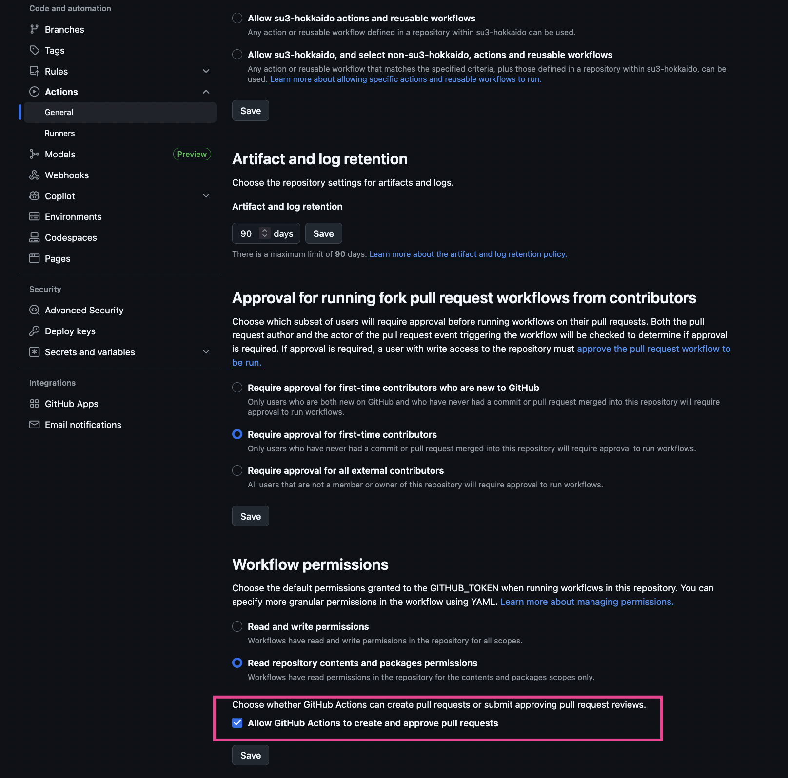

# Auto PR Creator with Github Actions

This is a general code asset to generate PR to merge diffs into the target branch by using Github Actions

# Published article about this repository

Please read this article: https://qiita.com/su3-hokkaido/items/8d4f198fd0a25b845256

# What is the benefit of this workflow

It helps your project to create PR which merge diffs from any test or development branch to the production branch.
After creating this workflow, Github Action will be triggered to open or update a PR to merge diffs from a test or development branch to the production branch.

# How to setup the Github Action

## 1: Allow Github Actions to create pull-requests

- Please access Settings > Actions > General in your repository
- Please enable `Read repository contents and packages permissions` in `Workflow permissions` section

## 2: Add files which are required for running Github Actions of creating PR

- Please refer to the following commit to know what files are required: https://github.com/su3-hokkaido/auto_pr_creator_with_github_actions/commit/fb3ab40181f1d043837fafc166dce446e7f03d7c
- `.git-pr-release` contains settings for specifying the source and target branches for merging diffs.
- `.github/CODEOWNERS` is an optional file, but this file is used for the branch rule setting if you want to assign a specific reviewer when Github Actions opens PR.
- `.github/git-pr-release.erb` contains the setting for writing a title of PR.
- `.github/workflows/create-d2m-pr.yml` contains some settings such as which branch Github Action should check, granting Github Action permissions for creating PRs and so on.
